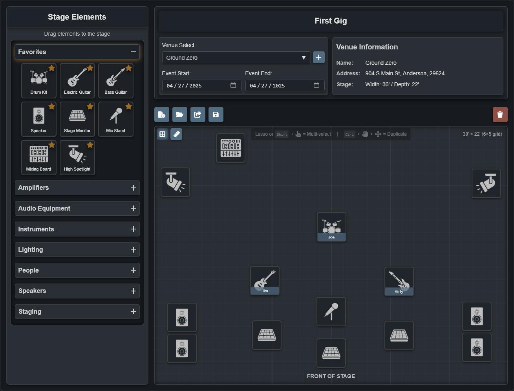

# StageWrite - <sub><sup>An intuitive and robust stage plotting web-app</sup></sub>

This is my capstone project for my Software and Web Development program.<br>
This stage plotting app allows the creation, saving, and sharing of stage plots/riders.<br>
Development of new and refined features is ongoing.

<br>



<br>

Adding a config.php file in private/config is required for this to run. Use this template:

```php
<?php

// Database configuration
$db_host = 'MyHost';
$db_name = 'MyDatabase';
$db_user = 'MyUserName';
$db_password = 'MyPassword';

// reCAPTCHA Configuration
define('RECAPTCHA_SITE_KEY', 'MySiteKey');
define('RECAPTCHA_SECRET_KEY', 'MySecretKey');

// Configuration constants
define('DB_HOST', $db_host);
define('DB_NAME', $db_name);
define('DB_USER', $db_user);
define('DB_PASS', $db_password);
define('DB_CHARSET', 'utf8mb4');

?>
```
